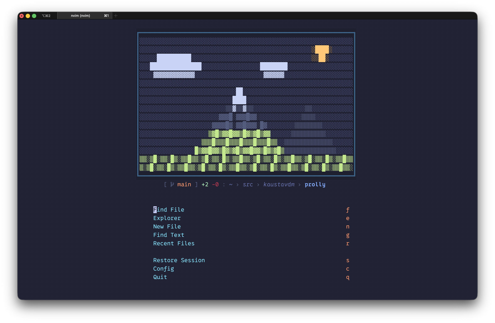
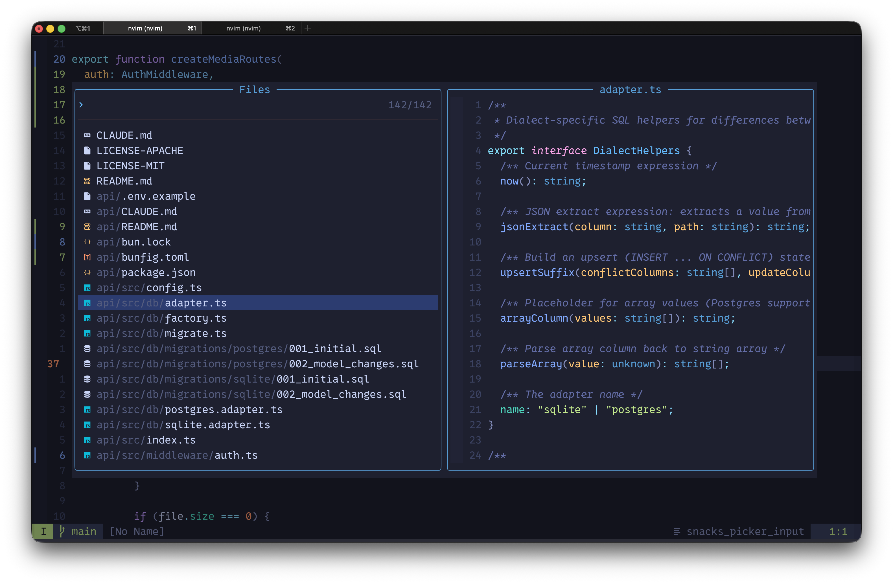
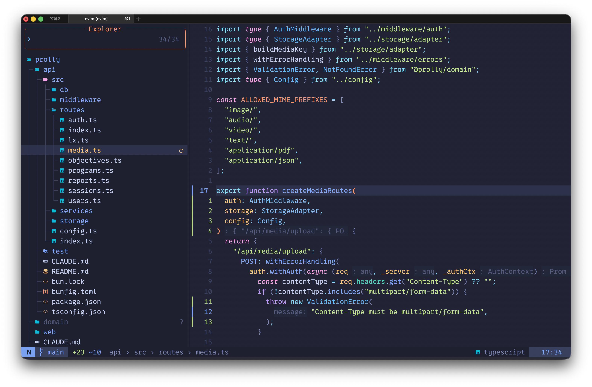
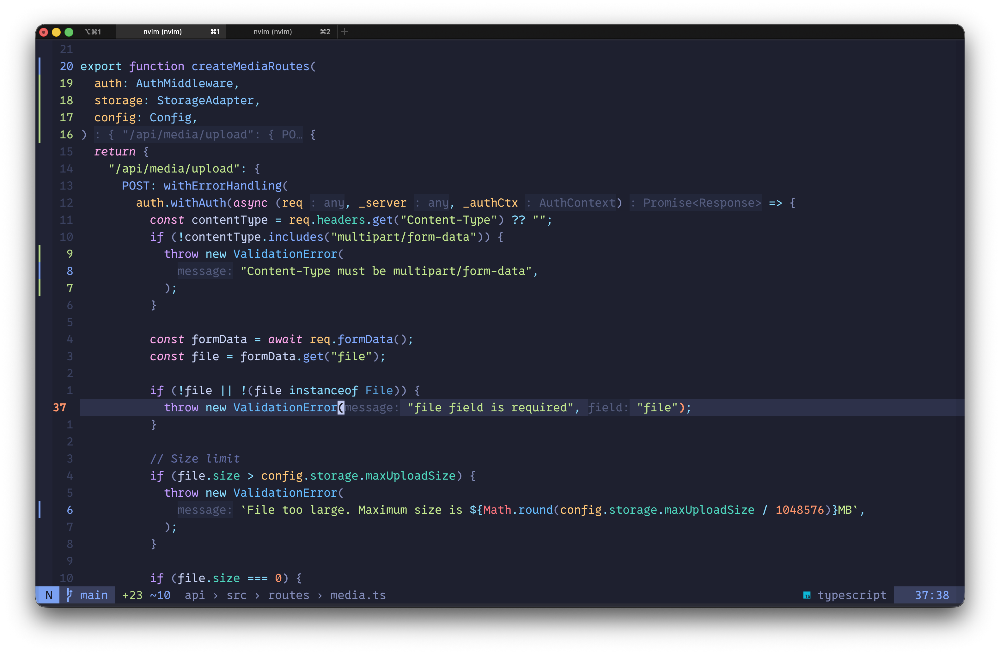
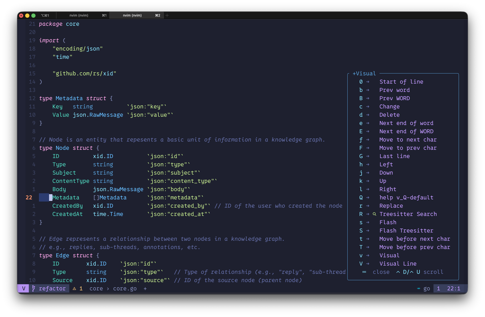

# Neovim Config

A fast, functional code/text editor configuration for Neovim, built on [lazy.nvim](https://github.com/folke/lazy.nvim) — focused on editing, not IDE features. Custom mountain landscape dashboard.

<table>
  <tr>
    <td align="center" colspan="2">
      <br/>
      <sub>Dashboard — banner art (mountains), git status &amp; cwd, quick list of actions</sub>
    </td>
  </tr>
  <tr>
    <td align="center" width="50%">
      <br/>
      <sub>Find file picker</sub>
    </td>
    <td align="center" width="50%">
      <br/>
      <sub>File explorer (Snacks)</sub>
    </td>
  </tr>
  <tr>
    <td align="center" width="50%">
      <br/>
      <sub>Git change markers in gutter</sub>
    </td>
    <td align="center" width="50%">
      <br/>
      <sub>Visual mode selection (pressed `V`)</sub>
    </td>
  </tr>
</table>

## Features

- **Fast startup** — targets <42ms, only 3 plugins load eagerly (colorscheme, snacks, treesitter)
- **Custom dashboard** — procedurally generated ASCII mountain art with git status
- **14 languages** — Go, Rust, Python, TypeScript, Svelte, Tailwind, Docker, Terraform, SQL, Prisma, JSON, YAML, TOML, Markdown
- **Native completion** — Neovim 0.11+ built-in LSP completion with autotrigger
- **Custom statusline** — single-letter mode, git branch, diff, file breadcrumbs, pending keys
- **Hidden command line** — `cmdheight=0` for a minimal UI; commands appear transiently

## Prerequisites

macOS with [Homebrew](https://brew.sh/). Use iTerm2 or similar as terminal.

```sh
# Core
brew install neovim fd ripgrep

# Nerd Font (required for icons)
brew install --cask font-0xproto-nerd-font

# Optional: tree-sitter CLI (only needed for building custom parsers)
brew install tree-sitter-cli
```

- **neovim** >= 0.11.0 (required for native LSP completion)
- **fd** — file finder used by the picker
- **ripgrep** — content search used by live grep
- **Nerd Font** — required for icons; any patched font works

> **Important:** Font, font-sizing, and font-spacing must be set in the terminal settings.
> e.g., set `0xProto Nerd Font` as the font in your iTerm2 profile.

## Setup

```sh
git clone https://github.com/kaustavdm/nvim-config.git ~/.config/nvim
nvim
```

lazy.nvim will install plugins on first launch. Mason will auto-install LSP servers and tools.

## Structure

```
~/.config/nvim/
  init.lua                    # Entry point: options → lazy → keymaps/autocmds
  CLAUDE.md                   # Claude Code project instructions
  lazy-lock.json              # Plugin version lockfile (auto-generated)
  stylua.toml                 # Lua formatter config
  lua/
    config/
      options.lua             # Vim options (loaded first, sets leader key)
      lazy.lua                # lazy.nvim bootstrap and setup
      keymaps.lua             # All non-plugin keymaps (loaded on VeryLazy)
      autocmds.lua            # Autocommands (loaded on VeryLazy)
    plugins/
      colorscheme.lua         # tokyonight (eager load)
      snacks.lua              # Dashboard + picker + explorer (eager load)
      treesitter.lua          # Treesitter, textobjects, autotag (eager load)
      ui.lua                  # Lualine, which-key, mini.icons
      editor.lua              # Flash, gitsigns, persistence
      coding.lua              # mini.pairs, mini.surround, mini.comment
      lsp.lua                 # LSP config, mason, native completion
      formatting.lua          # conform.nvim (format-on-save)
      linting.lua             # nvim-lint (debounced)
      lang/                   # One file per language (14 total)
    lib/
      mountain_art.lua        # Procedural dashboard art
      dashboard_status.lua    # Git status for dashboard
```

## Quick Usage Guide

### Opening Neovim

- `nvim` — opens dashboard with mountain art and quick actions
- `nvim file.lua` — opens file directly (no dashboard)
- `nvim .` — opens file explorer

### Essential Workflow

1. **Find files**: `<Space>ff` or `<Space>/` for grep
2. **Navigate**: `s` for flash jump, `<C-h/j/k/l>` between windows
3. **Edit**: `gc` to comment, `gsa` to add surroundings
4. **Code**: `gd` goto definition, `K` hover, `<Space>ca` code action
5. **Format**: auto on save, or `<Space>cf` manually
6. **Git**: gutter signs show changes, `]h`/`[h` navigate hunks

## Keymaps

Leader key is `<Space>`.

### File & Search

| Key         | Action         |
| ----------- | -------------- |
| `<Space>ff` | Find files     |
| `<Space>/`  | Live grep      |
| `<Space>fr` | Recent files   |
| `<Space>fg` | Git files      |
| `<Space>fc` | Config files   |
| `<Space>e`  | File explorer  |
| `<Space>E`  | Explorer (cwd) |

### Code & LSP

| Key         | Action               |
| ----------- | -------------------- |
| `gd`        | Goto definition      |
| `gr`        | References           |
| `gI`        | Goto implementation  |
| `gy`        | Goto type definition |
| `gD`        | Goto declaration     |
| `K`         | Hover documentation  |
| `gK`        | Signature help       |
| `<Space>ca` | Code action          |
| `<Space>cr` | Rename symbol        |
| `<Space>cR` | Rename file          |
| `<Space>cf` | Format               |
| `<Space>cd` | Line diagnostics     |
| `<Space>cl` | LSP info             |

### Navigation

| Key               | Action                  |
| ----------------- | ----------------------- |
| `s` / `S`         | Flash jump / treesitter |
| `<C-h/j/k/l>`     | Navigate windows        |
| `<S-h>` / `<S-l>` | Previous / next buffer  |
| `[b` / `]b`       | Previous / next buffer  |
| `]f` / `[f`       | Next / prev function    |
| `]c` / `[c`       | Next / prev class       |
| `]h` / `[h`       | Next / prev git hunk    |
| `]d` / `[d`       | Next / prev diagnostic  |

### Buffer & Window

| Key                      | Action               |
| ------------------------ | -------------------- |
| `<Space>bd`              | Delete buffer        |
| `<Space>bD`              | Delete other buffers |
| `<Space>wv`              | Split vertical       |
| `<Space>ws`              | Split horizontal     |
| `<Space>wd`              | Close window         |
| `<C-Up/Down/Left/Right>` | Resize windows       |

### Git (gitsigns)

| Key          | Action                    |
| ------------ | ------------------------- |
| `]h` / `[h`  | Next / prev hunk          |
| `<Space>ghs` | Stage hunk                |
| `<Space>ghr` | Reset hunk                |
| `<Space>ghS` | Stage buffer              |
| `<Space>ghu` | Undo stage hunk           |
| `<Space>ghp` | Preview hunk inline       |
| `<Space>ghb` | Blame line                |
| `<Space>ghd` | Diff this                 |
| `ih`         | Select hunk (text object) |

### Search

| Key         | Action                 |
| ----------- | ---------------------- |
| `<Space>sg` | Grep                   |
| `<Space>sw` | Grep word under cursor |
| `<Space>sb` | Grep open buffers      |
| `<Space>sh` | Help pages             |
| `<Space>sk` | Keymaps                |
| `<Space>sm` | Marks                  |
| `<Space>sr` | Resume last search     |
| `<Space>sd` | Diagnostics            |

### Toggles

| Key         | Action                  |
| ----------- | ----------------------- |
| `<Space>uf` | Toggle autoformat       |
| `<Space>ud` | Toggle diagnostics      |
| `<Space>ul` | Toggle line numbers     |
| `<Space>uL` | Toggle relative numbers |
| `<Space>uw` | Toggle word wrap        |
| `<Space>us` | Toggle spelling         |
| `<Space>ut` | Toggle statusline time  |


### Session & Quit

| Key         | Action                 |
| ----------- | ---------------------- |
| `<Space>qs` | Restore session        |
| `<Space>qS` | Select session         |
| `<Space>ql` | Restore last session   |
| `<Space>qd` | Don't save session     |
| `<Space>qq` | Quit all               |
| `<Space>l`  | Lazy (plugin manager)  |
| `<Space>cm` | Mason (tool installer) |
| `<Space>;`  | Dashboard              |

### Coding

| Key                | Action                       |
| ------------------ | ---------------------------- |
| `gc` / `gcc`       | Toggle comment (line/motion) |
| `gsa`              | Add surrounding              |
| `gsd`              | Delete surrounding           |
| `gsr`              | Replace surrounding          |
| `af` / `if`        | Around / inside function     |
| `ac` / `ic`        | Around / inside class        |
| `<A-j>` / `<A-k>`  | Move line down / up          |
| `<` / `>` (visual) | Indent and reselect          |

## Common Patterns

### Adding a New Language

Create `lua/plugins/lang/langname.lua`:

```lua
return {
  { "nvim-treesitter/nvim-treesitter", opts = { ensure_installed = { "lang" } } },
  { "neovim/nvim-lspconfig", opts = { servers = { server_name = {} } } },
  { "mason-org/mason.nvim", opts = { ensure_installed = { "tool" } } },
  { "stevearc/conform.nvim", opts = { formatters_by_ft = { lang = { "fmt" } } } },
  { "mfussenegger/nvim-lint", opts = { linters_by_ft = { lang = { "linter" } } } },
}
```

### Adding a New Plugin

Create a new file in `lua/plugins/` or add to an existing one:

```lua
return {
  {
    "author/plugin-name",
    event = "VeryLazy",  -- or: cmd, ft, keys
    opts = { ... },
  },
}
```

### Changing Colorscheme

Edit `lua/plugins/colorscheme.lua`:

```lua
return {
  {
    "author/theme.nvim",
    lazy = false,
    priority = 1000,
    config = function()
      vim.cmd.colorscheme("theme")
    end,
  },
}
```

## Statusline

The statusline (lualine) shows:

```
[N] main  +3 -1  ● 2  src › db › factory.ts     lua  d42:13  14:30
 │    │     │      │           │                   │    │  │     │
 │    │     │      │           │                   │    │  │     └─ Time (<Space>ut)
 │    │     │      │           │                   │    │  └─ Line:Col
 │    │     │      │           │                   │    └─ Pending keys
 │    │     │      │           │                   └─ Filetype
 │    │     │      │           └─ File path (breadcrumbs, auto-truncates)
 │    │     │      └─ Diagnostics
 │    │     └─ Git diff (additions green, deletions red)
 │    └─ Git branch
 └─ Mode: N=Normal, I=Insert, V=Visual, C=Command, R=Replace, T=Terminal
```

## Debugging

- `:checkhealth` — verify LSP, treesitter, mason
- `:Lazy` — plugin manager (update, clean, profile)
- `:Lazy profile` — startup performance
- `:Mason` — LSP/tool installer
- `nvim --startuptime /tmp/startup.log` — measure startup time

## License

[Apache 2.0](LICENSE)
